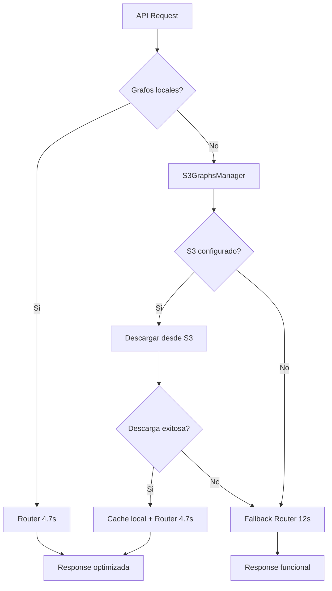

# ☁️ AMAZON S3 SETUP COMPLETO - GRAFOS CHILE

## 🎯 VENTAJAS DE S3 VS GOOGLE DRIVE

| Característica | Amazon S3 | Google Drive |
|---------------|-----------|--------------|
| **Velocidad** | ⚡ CDN Global | 🐌 Limitado |
| **Confiabilidad** | 99.999999999% | 99.9% |
| **Integración** | 🔧 API Nativa | 🔄 Workaround |
| **Seguridad** | 🔒 IAM + Policies | 📂 Enlaces públicos |
| **Escalabilidad** | ♾️ Ilimitada | 📏 15GB gratis |
| **Costo** | 💰 $0.023/GB/mes | 🆓 Gratis (limitado) |
| **Versionado** | ✅ Automático | ❌ Manual |
| **Profesional** | 🏢 Enterprise | 👤 Personal |

---

## 🚀 SETUP PASO A PASO

### 1️⃣ PREPARACIÓN LOCAL

```bash
# Ejecutar script automatizado
./setup_s3.sh

# ✅ Verifica dependencias (boto3)
# ✅ Comprime grafos (2.98GB → 1.1GB) 
# ✅ Crea configuración template
```

### 2️⃣ CONFIGURAR CREDENCIALES AWS

#### Opción A: AWS CLI (Recomendado)
```bash
# Instalar AWS CLI
curl "https://awscli.amazonaws.com/awscli-exe-linux-x86_64.zip" -o "awscliv2.zip"
unzip awscliv2.zip && sudo ./aws/install

# Configurar credenciales
aws configure
# AWS Access Key ID: [Tu Access Key]
# AWS Secret Access Key: [Tu Secret Key]
# Default region name: us-east-1
# Default output format: json
```

#### Opción B: Variables de Entorno
```bash
export AWS_ACCESS_KEY_ID="AKIA..."
export AWS_SECRET_ACCESS_KEY="xyz..."
export AWS_DEFAULT_REGION="us-east-1"

# Para persistir, agregar al ~/.bashrc o ~/.zshrc
echo 'export AWS_ACCESS_KEY_ID="AKIA..."' >> ~/.zshrc
```

#### Opción C: Archivo de Configuración
```bash
# Editar s3_config.json directamente
{
  "bucket_name": "goveling-ml-graphs-prod",
  "region": "us-east-1",
  "aws_access_key_id": "AKIA...",
  "aws_secret_access_key": "xyz..."
}
```

### 3️⃣ CREAR BUCKET S3

#### Via AWS Console
1. **Ir a**: https://console.aws.amazon.com/s3/
2. **Click**: "Create bucket"
3. **Nombre**: `goveling-ml-graphs-prod` (debe ser único globalmente)
4. **Región**: `us-east-1` (Virginia)
5. **Settings**:
   - ✅ Block all public access (recomendado)
   - ✅ Bucket versioning: Enable
   - ✅ Default encryption: Enable

#### Via AWS CLI
```bash
# Crear bucket
aws s3 mb s3://goveling-ml-graphs-prod --region us-east-1

# Configurar versionado
aws s3api put-bucket-versioning \
    --bucket goveling-ml-graphs-prod \
    --versioning-configuration Status=Enabled

# Configurar encriptación
aws s3api put-bucket-encryption \
    --bucket goveling-ml-graphs-prod \
    --server-side-encryption-configuration '{
        "Rules": [{
            "ApplyServerSideEncryptionByDefault": {
                "SSEAlgorithm": "AES256"
            }
        }]
    }'
```

### 4️⃣ CONFIGURAR IAM POLICY (Recomendado para Producción)

#### Crear Policy para Goveling ML:
```json
{
    "Version": "2012-10-17",
    "Statement": [
        {
            "Sid": "GovelingMLGraphsAccess",
            "Effect": "Allow",
            "Action": [
                "s3:GetObject",
                "s3:PutObject",
                "s3:DeleteObject",
                "s3:ListBucket"
            ],
            "Resource": [
                "arn:aws:s3:::goveling-ml-graphs-prod",
                "arn:aws:s3:::goveling-ml-graphs-prod/*"
            ]
        }
    ]
}
```

#### Crear Usuario IAM:
1. **AWS Console** → IAM → Users → Create User
2. **Username**: `goveling-ml-service`  
3. **Permissions**: Attach policy creada arriba
4. **Access Keys**: Create access key → Application running outside AWS
5. **Copiar**: Access Key ID y Secret Access Key

---

## 💻 USO DEL SISTEMA

### 🔧 Gestión Interactiva

```bash
# Abrir manager interactivo
python3 utils/s3_graphs_manager.py

# Opciones disponibles:
# 1. Ver estado (local + S3)
# 2. Descargar todos los grafos  
# 3. Subir todos los grafos
# 4. Asegurar grafos críticos
# 5. Descargar archivo específico
# 6. Subir archivo específico
```

### 📤 Upload Inicial (Una vez)

```bash
# Subir grafos comprimidos a S3
python3 -c "
from utils.s3_graphs_manager import S3GraphsManager
manager = S3GraphsManager()

# Subir cada grafo
files = ['chile_graph_cache.pkl', 'chile_nodes_dict.pkl', 
         'santiago_metro_walking_cache.pkl', 'santiago_metro_cycling_cache.pkl']

for filename in files:
    print(f'⬆️ Subiendo {filename}...')
    success = manager.upload_graph(filename)
    print(f'✅ {filename} subido' if success else f'❌ Error: {filename}')
"
```

### 📥 Descarga Automática (Producción)

```python
# En tu aplicación (ya integrado en api.py)
from utils.s3_graphs_manager import S3GraphsManager

manager = S3GraphsManager()

# Descargar solo grafos críticos faltantes
manager.ensure_critical_graphs()

# ✅ Sistema funcionará con cache optimizado (4.7s)
# ⚠️ Fallback sin cache si falla S3 (12s)
```

---

## 📊 MONITOREO Y COSTOS

### 💰 Estimación de Costos S3

```
📦 Almacenamiento: 1.1GB comprimido
💵 Costo mensual: ~$0.025 USD ($0.023/GB)
📥 Descargas: ~$0.0004 por GB transferido
🎯 Total estimado: <$1 USD/mes para uso normal
```

### 📈 Métricas de Performance

```python
# Verificar métricas de descarga
python3 -c "
from utils.s3_graphs_manager import S3GraphsManager
import time

manager = S3GraphsManager()
status = manager.check_cache_status()

for filename, info in status.items():
    print(f'{filename}:')
    print(f'  🖥️ Local: {\"✅\" if info[\"exists_local\"] else \"❌\"}')
    print(f'  ☁️ S3: {\"✅\" if info[\"exists_s3\"] else \"❌\"}')
    if info['size_s3']:
        print(f'  📏 S3 size: {info[\"size_s3\"]/1024/1024:.1f} MB')
"
```

---

## 🔧 TROUBLESHOOTING

### ❌ Problemas Comunes

#### 1. "NoCredentialsError"
```bash
# Verificar credenciales
aws sts get-caller-identity

# Si falla, reconfigurar:
aws configure
```

#### 2. "BucketDoesNotExist"
```bash
# Verificar bucket existe
aws s3 ls s3://tu-bucket-name

# Si no existe, crear:
aws s3 mb s3://tu-bucket-name --region us-east-1
```

#### 3. "AccessDenied"
```bash
# Verificar permisos IAM
aws s3 ls s3://tu-bucket-name --debug
```

#### 4. "Slow Downloads"
```python
# Verificar región del bucket
import boto3
s3 = boto3.client('s3')
response = s3.get_bucket_location(Bucket='tu-bucket-name')
print(f"Bucket region: {response['LocationConstraint']}")

# Usar región más cercana para mejor performance
```

### 📋 Verificación del Sistema

```bash
# Test completo del sistema S3
python3 -c "
from utils.s3_graphs_manager import S3GraphsManager
import logging

logging.basicConfig(level=logging.INFO)

print('🔍 Testing S3 system...')
manager = S3GraphsManager()

if manager.s3_client:
    print('✅ S3 client initialized')
    
    # Test bucket access
    try:
        status = manager.check_cache_status()
        print(f'✅ Bucket accessible: {len(status)} files configured')
        
        # Test critical graphs
        result = manager.ensure_critical_graphs()
        print(f'✅ Critical graphs: {\"Ready\" if result else \"Missing\"}')
        
    except Exception as e:
        print(f'❌ S3 test failed: {e}')
else:
    print('❌ S3 client not initialized - check credentials')
"
```

---

## 🎯 FLUJO DE PRODUCCIÓN

### 🔄 Workflow Automatizado



### 🚀 Performance Esperada

| Escenario | Primera ejecución | Siguientes |
|-----------|------------------|------------|
| **Con S3** | ~10s (descarga + routing) | 4.7s |
| **Sin S3** | 12s (fallback) | 12s |
| **Híbrido** | 4.7s (cache local) | 4.7s |

---

## ✅ CHECKLIST FINAL

- [ ] **AWS Account** configurada con credenciales válidas
- [ ] **Bucket S3** creado con permisos apropiados  
- [ ] **s3_config.json** actualizado con información real
- [ ] **Grafos comprimidos** subidos exitosamente a S3
- [ ] **Test de descarga** completado exitosamente
- [ ] **API integration** probada con endpoint Chile
- [ ] **Fallback system** verificado sin S3
- [ ] **Monitoring** configurado para costos S3

🎉 **¡Sistema S3 listo para producción!** 

*La performance de routing Chile será 4.7s con descarga automática desde S3* ⚡